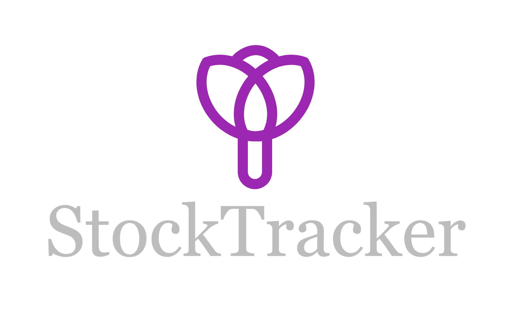

## Preview


## About

A simple VueJs/Flask SPA web app is a bespoke dashboard which helps track stocks of interest and maximise your earnings. 
The stocks can ben added using Yahoo finance symbols (*My Stocks*), the user sets upper and lower threshold values to monitor gain/loss. Once the threshold has been reached user should in theory either sell the shares or reset the threshold - that's what app will suggest. 

## Live demo
[Live demo](https://stock-tracker-webapp.nw.r.appspot.com/)


## How to use

1. Add/update/delete stocks *Settings* -> *MyStocks* -> *NewStock*
2. See *Dashboard* -> *Live Feed* for live stock trending and your overall loss/gain
3. See *Dashboard* -> *Historical View* to inspect historical data and FTSE indices

## TODO
1. Add autocomplete to New Stock feature - populate symbol and company name as typed
2. Add ML model for more informed decisions 
3. Add stocks Export/Import as/from csv/json 

## Tech stack
* **Front-end**: Vue.js, vuex, vue-router, vuetify, plotly.js
* **Back-end**: flask, yahoo finance API, postgreSQL
* **DevOps**: Google Cloud App Engine/Github Actions
  
## Installation for local use

1. Clone the repo and navigate to stock-tracker-spa directory
```bash
git clone https://github.com/lidia-nna/stock-tracker-spa.git
cd stock-tracker-spa
```
2. Create and activate virtual env
```bash
python3 -m venv your-venv
source your-venv/bin/activate
```
3. Set env variables: edit  `.env` file:
   * *CONFIG*=DevConfig/ProdConfig
   * *MAIL_...* should only be set if you intend to create a new account (should use your own email credentials)
   * the remaining variables can be set to any random string
```bash
nano .env
export $(cat .env)
```
4. Install required python packages

```bash
pip install -r requirements.txt
````
5. Run API

```bash
python ./main.py
```
6. Navigate to web app component
```bash
cd stock-tracker-web
touch .env.local.development # for dev
touch .env.local.production # for prod

nano .env.local.development
--> VUE_API_URL=http://localhost:5000 

nano .env.local.production
--> VUE_API_URL=https://<api-url-in-production>
```

7. Ensure npm is downloaded and up to date (https://nodejs.org/en/download/)
```bash
npm install
npm run serve # dev
npm run build # prod
```
8. Visit `http://localhost:8080` to check the app